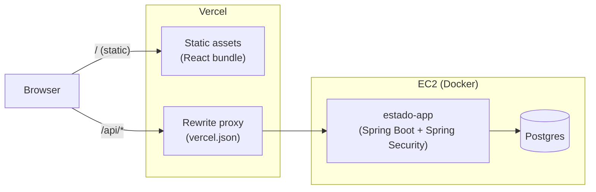
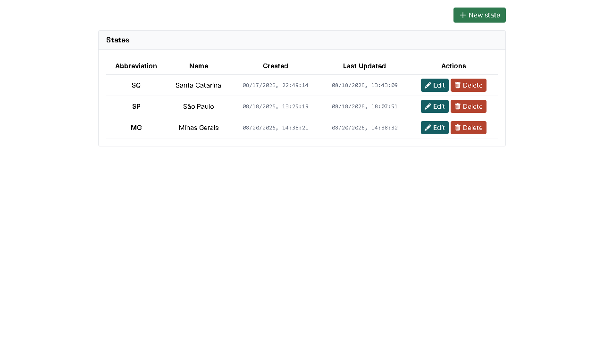
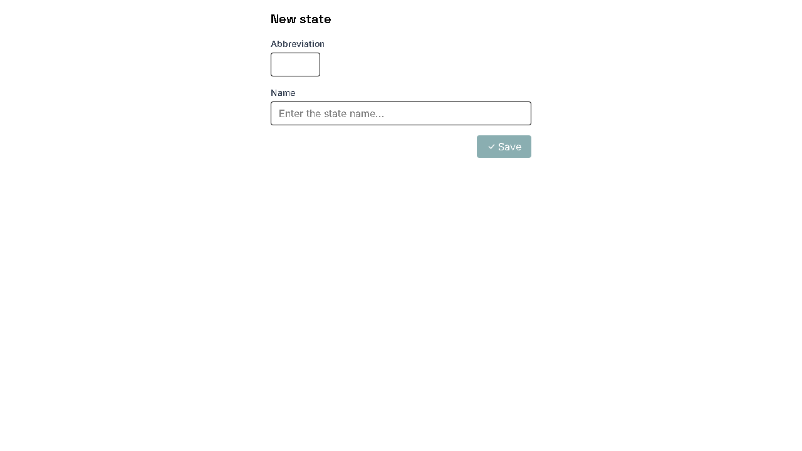

# react_state

[](https://github.com/ronybrand/react_state/actions/workflows/ci.yml)
[](https://github.com/ronybrand/react_state/actions/workflows/codeql.yml)
[](https://codecov.io/gh/ronybrand/react_state)

🔗 **[Live application](https://react-state-flax.vercel.app/)**

CRUD for Brazilian federative units (states) — abbreviation, name, and
created/updated timestamps — consuming the [Estado project](https://github.com/ronybrand/estado)'s
REST API at `/api/estado`. An alternate React frontend for the same backend, alongside the
original [Angular one](https://github.com/ronybrand/angular_estado).

## Architecture



The app never talks to the backend's own origin — `vercel.json` rewrites
`/api/*` to it, so the browser only ever sees the deployment's own origin
(see [Deployment](#deployment) below). This diagram is infra/network
topology, not API routes — it doesn't distinguish `GET` from
`POST`/`PUT`/`DELETE` on `/estado`, so JWT auth (an internal concern of
the Spring Boot app itself) doesn't add a box or arrow here either.
`POST /auth/login` returns a short-lived JWT, kept in `localStorage` and
attached as `Authorization: Bearer <token>` by an axios request
interceptor on state-mutating calls only — listing and reading states
stays public, matching the backend's own authorization rule.

## Screenshots




## Stack

- [React 19](https://react.dev/) + TypeScript (strict) + [Vite](https://vite.dev/)
- [TanStack Query](https://tanstack.com/query) for data-fetching, caching, and invalidation
- [Axios](https://axios-http.com/) with request-id and timeout/retry interceptors
- [React Router](https://reactrouter.com/) (data router) with lazy-loaded routes
- [React Hook Form](https://react-hook-form.com/) for form validation
- [Tailwind CSS](https://tailwindcss.com/) v4
- [Vitest](https://vitest.dev/) + [React Testing Library](https://testing-library.com/react) for component tests
- ESLint (typescript-eslint + react-hooks + jsx-a11y) + Prettier + Husky/lint-staged

## Structure

```
src/
├── pages/               # StateList, CreateState, EditState, Login (routes)
├── shared/
│   ├── Layout/             # app shell: title bar + <Outlet/> + Footer
│   ├── Footer/              # FE/BE build info, hides silently on failure
│   ├── StateForm/            # create/edit form (React Hook Form)
│   ├── FormPage/              # shared create/edit page shell (title + ErrorMessage wrapper)
│   ├── ErrorMessage/          # error alert (role="alert") + useErrorMessage hook
│   ├── ProtectedRoute/          # redirects to /login when the JWT is missing/expired
│   ├── Spinner/                   # loading indicator (role="status")
│   ├── Icon/                       # SVG icons centralized by name
│   └── RouteError/                  # render-error fallback per route
├── hooks/                # TanStack Query hooks (list, get, create, update, delete,
│                            login, frontend/backend version for the footer)
├── lib/                  # httpClient (axios + interceptors), tokenStorage (JWT in
│                            localStorage), error extractors, formatDate
├── interfaces/           # State / NewState / FrontendVersion / BackendInfo domain types
├── services/             # stateService + stateApiMapper (wire <-> domain), authService,
│                            infoService
└── router.tsx              # routes with lazy loading, wrapped in Layout

scripts/
└── generate-version.mjs  # writes public/version.json (commit + build date) on build,
                             read by the footer to show the deployed frontend version
```

### Conventions

- Function components + hooks, no classes.
- Data cache via TanStack Query (`hooks/`) instead of manual per-page
  fetching — every mutation invalidates the affected query, keeping the
  list in sync across navigations.
- `httpClient` (`lib/httpClient.ts`) centralizes a 15s timeout and retry
  (up to 2 attempts, GET only) via axios interceptors; the `X-Request-Id`
  header is generated once per action and preserved across retries, so all
  attempts correlate as a single action in the backend logs.
- The backend's actual JSON contract uses Portuguese field names
  (`sigla`, `nome`, `dataHoraCadastro`, `dataHoraUltimaAtualizacao`) and the
  API path segment is `/estado` — both are the real wire contract and are
  **not** translated. `services/stateApiMapper.ts` is a small
  anti-corruption layer that maps that wire format to/from the English
  `State` domain type, so the rest of the app never sees the Portuguese
  field names.
- Accessibility: `aria-invalid`/`aria-describedby` on form fields, dynamic
  `aria-label` on the per-row action buttons, `role="status"`/`role="alert"`
  for loading/error states.
- Request errors (query/mutation) are handled per page via
  `useErrorMessage`; unexpected render errors are caught by React Router's
  `errorElement` (`RouteError`), avoiding a blank screen.

## Prerequisites

Requires a State API backend running locally at `http://localhost:8090` —
without it, `npm run dev` still serves the UI, but calls to `/api/*` fail
(the list shows the error message once the retry is exhausted).

## Development server

```bash
npm install
npm run dev
```

Vite proxies `/api` to `http://localhost:8090` (see `vite.config.ts`). Open
`http://localhost:5173/`.

### Environment variables

`VITE_API_URL` overrides the backend base URL used by `httpClient`
(defaults to `/api`, proxied by Vite/Vercel as described above) — set it to
point the app at a different backend without touching `vite.config.ts`.

## Build

```bash
npm run build
```

Outputs the build artifacts to `dist/`.

## Deployment

Live at **[react-state-flax.vercel.app](https://react-state-flax.vercel.app/)**.
`vercel.json` deploys the app as a static SPA and rewrites `/api/*` to the
live backend, the same origin-proxy pattern used in development
(`vite.config.ts`) — the browser only ever talks to the deployment's own
origin, so it avoids CORS entirely (the backend only allows its own
CloudFront origin). Run `npx vercel --prod` from a Vercel-linked checkout.

There's no one-click "Deploy with Vercel" button: `vercel.json` points
`/api/*` at this project's own backend, so a clone deployed elsewhere
would render fine but every API call would fail (that backend's CORS only
allows its own origin).

## Lint and formatting

```bash
npm run lint          # eslint
npm run format:check  # prettier --check
npm run format        # prettier --write
```

Husky + lint-staged run `eslint --fix` and `prettier --write` on pre-commit.

## Tests

```bash
npm test               # vitest
npm run test:coverage  # vitest run --coverage
```

Vitest + React Testing Library, covering the list/create/edit/delete flows,
shared-form validation, the support components (`Icon`, `Spinner`,
`ErrorMessage`/`useErrorMessage`, `RouteError`), and `lib`/`services`
utilities. Coverage is reported in CI via Codecov, gated at 90% (project) /
80% (patch).
